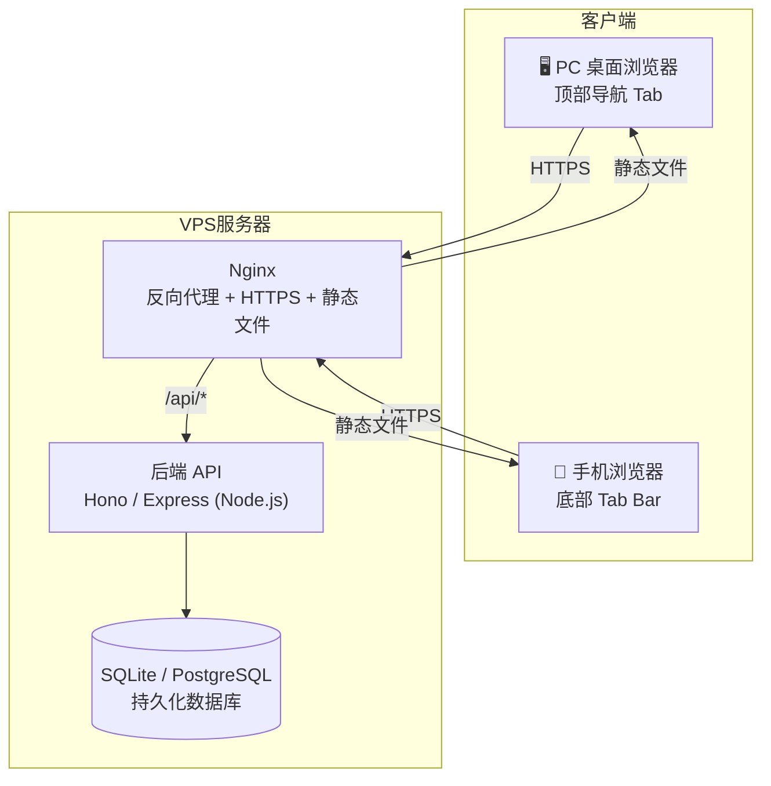

# 🏠 居安择时 — 全栈改造方案

> **目标**：将现有纯前端 (localStorage) 单页应用改造为支持 **PC 桌面 + 手机浏览器** 双端访问、数据云端持久化的全栈 Web App，部署到 VPS 服务器。

---

## 一、现状分析

| 维度 | 现状 | 问题 |
|------|------|------|
| 前端框架 | React 19 + TypeScript + Vite | ✅ 保留 |
| 数据存储 | `localStorage` | ❌ 单设备，换手机/浏览器即丢失 |
| 响应式布局 | Navbar 横向滚动 Tab | ⚠️ 手机端体验差，需适配底部 Tab Bar |
| 后端 | 无 | ❌ 无法多端同步、无用户隔离 |
| 部署 | 无 | ❌ 需要 VPS 部署方案 |

---

## 二、目标架构



---

## 三、技术选型

### 3.1 后端方案（推荐 Hono + SQLite）

> [!TIP]
> **为什么选 Hono + SQLite？**
> - Hono 轻量极快，TypeScript 原生支持，与现有前端共享类型
> - SQLite 无需独立数据库服务，单文件存储，VPS 零运维成本
> - 后期需要多人协作可平滑迁移至 PostgreSQL

```
后端技术栈：
- 运行时：Node.js 20 LTS
- 框架：Hono (or Express)
- 数据库：SQLite (better-sqlite3) → 可迁移 PostgreSQL
- 认证：JWT + 简单密码（个人使用）或不设登录直接用
- 进程管理：PM2
```

### 3.2 前端响应式方案

```
- PC (≥768px)：保持现有顶部 Navbar Tab 横向布局
- 手机 (<768px)：改为底部固定 Tab Bar（底部导航栏）
- 共享同一套组件，CSS media query 控制显隐
```

---

## 四、改造步骤详解

### Step 1：新建后端项目结构

```
prediction/
├── src/                   # 现有前端代码（保留）
├── server/                # 新增后端
│   ├── index.ts           # Hono 入口
│   ├── db.ts              # SQLite 初始化 & 建表
│   ├── routes/
│   │   ├── communities.ts # /api/communities CRUD
│   │   ├── listings.ts    # /api/listings CRUD
│   │   └── notes.ts       # /api/notes CRUD
│   └── types.ts           # 共享类型（复用 src/types/）
├── data/                  # SQLite 数据库文件
│   └── app.db
├── package.json           # 新增 server 依赖
└── vite.config.ts         # 开发时配置 proxy /api → server
```

### Step 2：数据库表设计（SQLite）

```sql
-- 小区信息
CREATE TABLE communities (
  id TEXT PRIMARY KEY,
  name TEXT NOT NULL,
  district TEXT,
  sector TEXT,
  ring_location TEXT,
  built_year INTEGER,
  property_fee REAL,
  property_company TEXT,
  metro_info_text TEXT,
  school_info TEXT,
  amenities TEXT,
  pros TEXT,          -- JSON array
  cons TEXT,          -- JSON array
  asking_avg_price REAL,
  deal_avg_price REAL,
  rent_samples TEXT,  -- JSON array
  avg_rent_unit_price REAL,
  created_at DATETIME DEFAULT CURRENT_TIMESTAMP,
  updated_at DATETIME DEFAULT CURRENT_TIMESTAMP
);

-- 房源
CREATE TABLE listings (
  id TEXT PRIMARY KEY,
  community_id TEXT REFERENCES communities(id) ON DELETE CASCADE,
  unit_number TEXT,
  total_price REAL,
  target_price REAL,
  building_area REAL,
  inside_area REAL,
  layout TEXT,
  floor_info TEXT,
  orientation TEXT,
  renovation TEXT,
  expected_monthly_rent REAL,
  floorplan_url TEXT,
  rating INTEGER,
  notes TEXT,
  is_sub_new INTEGER DEFAULT 0,
  is_near_metro INTEGER DEFAULT 0,
  is_sweet_spot_layout INTEGER DEFAULT 0,
  created_at DATETIME DEFAULT CURRENT_TIMESTAMP,
  updated_at DATETIME DEFAULT CURRENT_TIMESTAMP
);

-- 置业笔记
CREATE TABLE housing_notes (
  id TEXT PRIMARY KEY,
  title TEXT NOT NULL,
  content TEXT,
  category TEXT,
  district TEXT,
  sector TEXT,
  community_name TEXT,
  importance TEXT,
  created_at TEXT,
  tags TEXT,          -- JSON array
  updated_at DATETIME DEFAULT CURRENT_TIMESTAMP
);
```

### Step 3：API 接口设计（RESTful）

| 方法 | 路径 | 说明 |
|------|------|------|
| GET | `/api/communities` | 获取所有小区 |
| POST | `/api/communities` | 新增小区 |
| PUT | `/api/communities/:id` | 修改小区 |
| DELETE | `/api/communities/:id` | 删除小区 |
| GET | `/api/listings` | 获取所有房源（可带 `?communityId=xx` 筛选） |
| POST | `/api/listings` | 新增房源 |
| PUT | `/api/listings/:id` | 修改房源 |
| DELETE | `/api/listings/:id` | 删除房源 |
| GET | `/api/notes` | 获取所有笔记 |
| POST | `/api/notes` | 新增笔记 |
| PUT | `/api/notes/:id` | 修改笔记 |
| DELETE | `/api/notes/:id` | 删除笔记 |

### Step 4：前端存储层替换

**改造策略：最小侵入式改造**

只改 `src/utils/communityStorage.ts` 和 `src/utils/notesStorage.ts`，组件代码**完全不变**。

```typescript
// 改造后的 communityStorage.ts（核心变化）

const BASE = '/api';

export async function getStoredCommunities(): Promise<Community[]> {
  const res = await fetch(`${BASE}/communities`);
  if (!res.ok) return initialSampleCommunities; // 降级到默认数据
  return res.json();
}

export async function saveCommunities(communities: Community[]) {
  // 改为单条 upsert 或批量 sync，不再整体替换
  // 具体由组件改为调用 addCommunity / updateCommunity / deleteCommunity
}

// 新增细粒度 CRUD 函数
export async function addCommunity(c: Community): Promise<Community> { ... }
export async function updateCommunity(c: Community): Promise<Community> { ... }
export async function deleteCommunity(id: string): Promise<void> { ... }
```

> [!IMPORTANT]
> 前端函数签名从**同步**改为**异步（async/await）**，所有调用处需要相应更新。

### Step 5：手机端响应式 UI 改造

**底部 Tab Bar（手机端）**

```tsx
// 在 App.tsx 中添加：
// - PC：渲染 <Navbar>（顶部）
// - 手机：渲染 <MobileTabBar>（底部固定）

const isMobile = useMediaQuery('(max-width: 767px)');

return (
  <div>
    {!isMobile && <Navbar ... />}
    <main style={{ paddingBottom: isMobile ? '70px' : '0' }}>
      {/* 内容区 */}
    </main>
    {isMobile && <MobileTabBar ... />}
  </div>
);
```

**MobileTabBar 样式要点：**
- `position: fixed; bottom: 0; left: 0; right: 0`
- 只显示 5 个最常用 Tab（图标 + 简短文字）
- 适配 iPhone 底部安全区：`padding-bottom: env(safe-area-inset-bottom)`

### Step 6：VPS 部署方案

```
VPS 环境：
- OS: Ubuntu 22.04
- Node.js 20 LTS (通过 nvm 安装)
- PM2 (进程守护)
- Nginx (反代 + HTTPS)
- Let's Encrypt (免费 SSL)
```

**Nginx 配置核心片段：**

```nginx
server {
    listen 443 ssl;
    server_name your-domain.com;

    # SSL 证书（Let's Encrypt）
    ssl_certificate /etc/letsencrypt/live/your-domain.com/fullchain.pem;
    ssl_certificate_key /etc/letsencrypt/live/your-domain.com/privkey.pem;

    # 前端静态文件（vite build 产物）
    root /var/www/prediction/dist;
    index index.html;

    location / {
        try_files $uri $uri/ /index.html;  # SPA 路由支持
    }

    # 后端 API 反代
    location /api/ {
        proxy_pass http://localhost:3001/api/;
        proxy_set_header Host $host;
        proxy_set_header X-Real-IP $remote_addr;
    }
}
```

**PM2 启动：**

```bash
# 启动后端
pm2 start dist-server/index.js --name prediction-api

# 开机自启
pm2 startup && pm2 save
```

**部署流程：**

```bash
# 本地
npm run build         # 构建前端 → dist/
npm run build:server  # 构建后端 → dist-server/

# 上传到 VPS
rsync -avz dist/ user@vps:/var/www/prediction/dist/
rsync -avz dist-server/ user@vps:/var/www/prediction/dist-server/

# VPS 上
pm2 restart prediction-api
```

---

## 五、改造优先级与工作量

| 优先级 | 任务 | 预估工作量 |
|--------|------|-----------|
| 🔴 P0 | 搭建后端 Hono + SQLite + CRUD API | 4-6h |
| 🔴 P0 | 改造 communityStorage.ts / notesStorage.ts 为异步 API 调用 | 3-4h |
| 🟡 P1 | 手机端底部 Tab Bar 组件 | 2-3h |
| 🟡 P1 | VPS 部署脚本 + Nginx 配置 + PM2 | 2-3h |
| 🟢 P2 | 简单密码保护（防止他人编辑）| 1-2h |
| 🟢 P2 | 图片上传（户型图替换默认 SVG）| 2-3h |

---

## 六、关键决策点

> [!NOTE]
> 以下几个问题需要你确认，影响具体实现方式：

1. **是否需要用户认证？** 
   - 个人独用 → 简单密码 + JWT，或直接不设权限
   - 多人使用 → 需要完整用户系统

2. **数据库选择？**
   - SQLite：零运维，适合个人 / 轻量团队
   - PostgreSQL：适合高并发、多人实时协作

3. **是否需要离线能力？**
   - 需要 → 引入 Service Worker + IndexedDB 离线缓存
   - 不需要 → 有网才能用，更简单

4. **域名是否已有？**
   - 有域名 → 配 HTTPS + SSL
   - 无域名 → 直接 IP + 端口访问

---

## 七、推荐实施顺序

```
第一步：本地先跑通后端 API（Hono + SQLite）
    ↓
第二步：前端 storage 层改为 fetch API（vite dev proxy 转发）
    ↓
第三步：手机端底部 Tab Bar 响应式改造
    ↓
第四步：VPS 部署 + Nginx + PM2
    ↓
第五步：(可选) 简单密码保护 + 图片上传
```
